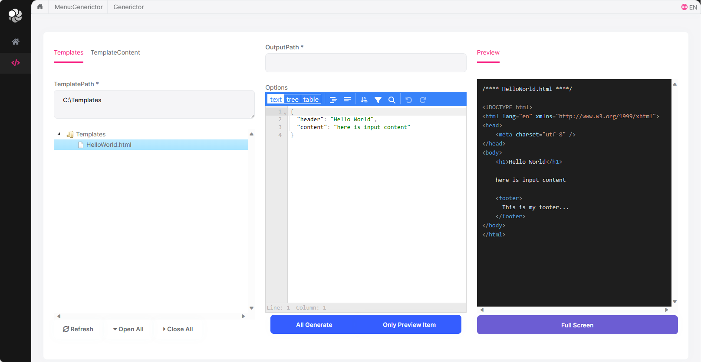

## About this solution

This is a minimalist, non-layered startup solution with the ABP Framework. All the fundamental ABP modules are already installed.

## How to run

The application needs to connect to a database. Run the following command in the `ToolMan` directory:

````bash
dotnet run --migrate-database
````

This will create and seed the initial database. Then you can run the application with any IDE that supports .NET.

Happy coding..!

## Getting Started


## Tutorials
>First we need to create a template directory, create the `Templates` directory on disk and add the following entries:

* #### SayHelloTo{{Name}}.html
```
<!DOCTYPE html>
<html lang="en" xmlns="http://www.w3.org/1999/xhtml">
<head>
    <meta charset="utf-8" />
</head>
<body>
    <h1>Wellcome {{Name}}</h1>

    {{ include '@sayhi.txt' }}

    <footer>
      This is my footer...
    </footer>
</body>
</html>

```

* #### @sayhi.txt
```
<div>
    {{Name}} here are the include files !
</div
```

>Now we open the programme page to set the generation parameters and run `Generate`
* TemplatePath: `x:\youpath\Templates`
* OutputPath：`C:\ResultRender`
* Options:
```
{
    "Name": "ToolMan"
}
```

>Open `C:\ResultRender` directory see the result files

## Browser extensions
Dealing with code tags at the end of paragraphs after translation of web pages. [>click here<](https://microsoftedge.microsoft.com/addons/detail/%E7%BF%BB%E8%AF%91%E8%AE%BE%E7%BD%AE/kfgcdfhmodedolojlfmnpkdlnaaboiee)
